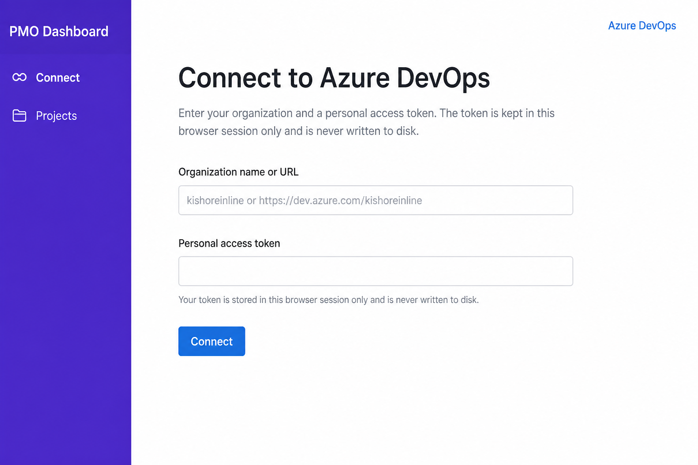
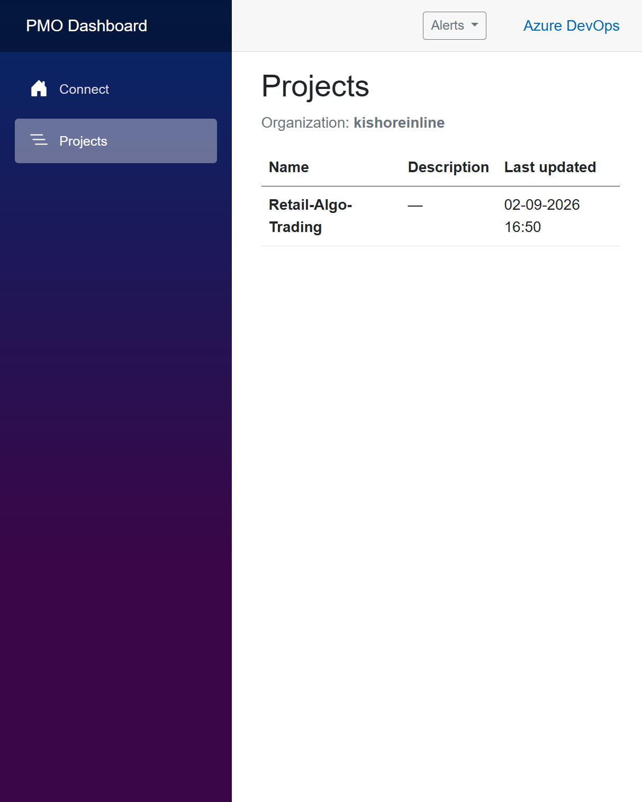
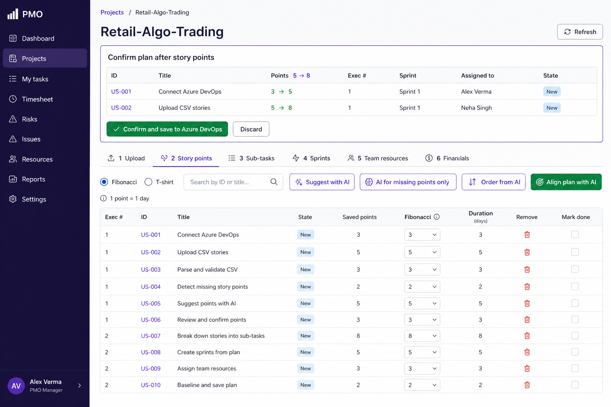
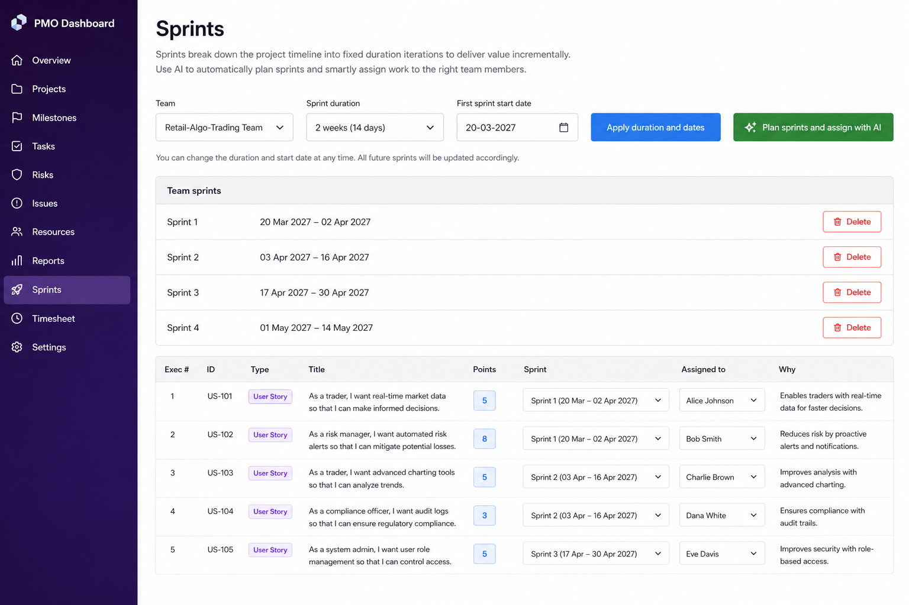
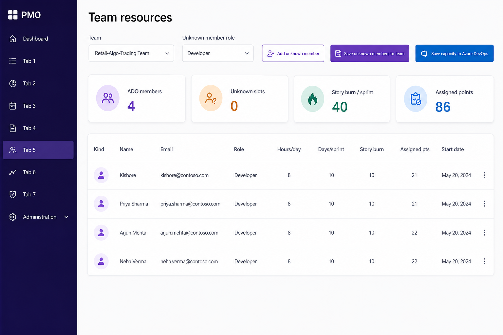
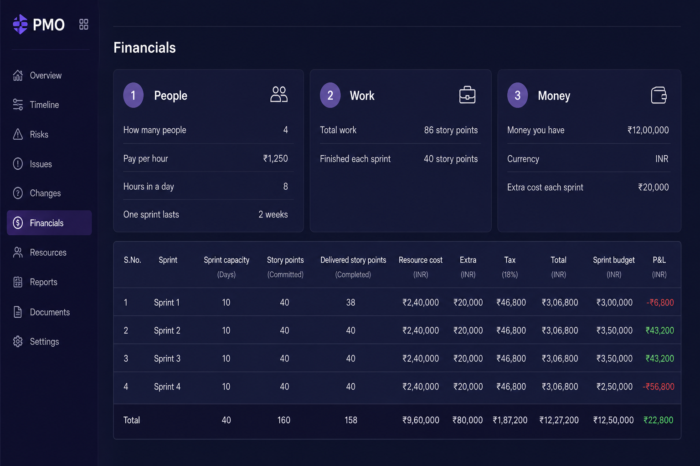

# PMO-Automation

Public overview of **PMO Automation** — an **AI project** and a **wrapper on Azure DevOps** to automate project management for **Agile Scrum**.

This repository is **still in progress**. It exists **purely to demonstrate PM automation using AI**.

Connect an Azure DevOps organization through the UI. The app uses AI to estimate story points, order work, pack sprints within team capacity, and realign the plan when the backlog changes. Azure DevOps is the live board.

## Screenshots

### Connect

PAT-based connect. The token stays in the browser session only.



### Projects

Pick an Azure DevOps project to open the PMO tabs.



### Tab 2 — Story points

Fibonacci or T-shirt scale (**1 point = 1 day**). AI can suggest points and execution order. Changing points, removing points, changing Exec #, or marking a story done realigns the plan. Confirm before anything is written to Azure DevOps.



### Tab 4 — Sprints

Set duration and first start date, delete sprints you do not need, then pack whole stories into dated sprints without exceeding team capacity.



### Tab 5 — Team resources

ADO members, start dates, story burn per sprint, and assigned load after the latest plan.



### Tab 6 — Financials

People, work, and money boxes, then a sprint-by-sprint bill (capacity-capped).



## What it does

After you connect with a personal access token (PAT), pick a project. Six tabs stay on one page:

| Tab | Purpose |
| --- | --- |
| 1 — Upload | Preview a CSV of user stories, skip duplicates by title, then create work items in Azure DevOps. |
| 2 — Story points | Fibonacci or T-shirt scale (**1 point = 1 day**). AI can suggest points and execution order. Change points, remove points, change Exec #, or mark a story done. |
| 3 — Sub-tasks | Only stories with points are groomed. Pick a story type and create the matching child tasks. |
| 4 — Sprints | Set duration and first start date, apply those dates, delete sprints you do not need, then pack whole stories into dated sprints without exceeding team capacity. |
| 5 — Team resources | ADO members, start dates, story burn per sprint, and assigned load after the latest plan. |
| 6 — Financials | People, work, and money boxes, then a sprint-by-sprint bill (capacity-capped). |

Any change to points, assignment, done state, or execution order asks **AI to realign the whole plan**. A confirm preview appears at the top of the project page. Nothing is written to Azure DevOps until you confirm. Discard leaves Azure DevOps unchanged.

Stories with **no points** leave the sprint plan (backlog, unassigned). Remaining pointed stories are re-packed. Tabs 3–6 refresh from that plan.

## Requirements

- .NET 8 SDK
- An Azure DevOps organization and a PAT that can read (and write) work items, iterations, and team membership
- Optional: an OpenAI-compatible API key for model-based estimates and sprint assignment (otherwise built-in packing rules are used)

Personal Microsoft accounts cannot use work/school Entra sign-in. **PAT-based Connect is the supported path.**

## Run

```bash
dotnet run --project src/RetailAlgoTrading.Pmo --launch-profile http
```

Open [http://localhost:5074](http://localhost:5074). Use **Connect**, then **Projects**.

In Visual Studio: open `RetailAlgoTrading.Pmo.sln`, **Shift+F5** to rebuild, then **F5**.

## Connect

On **Connect**, enter:

- Organization name or URL (for example `kishoreinline` or `https://dev.azure.com/kishoreinline`)
- Personal access token

The token stays in **session memory only**. It is never written to disk.

Suggested PAT scopes: Work Items (read & write), Project and team (read), and enough access to update iterations and team capacity.

## CSV format

Sample file: `src/RetailAlgoTrading.Pmo/wwwroot/samples/user-stories.sample.csv`

Columns (case-insensitive):

- Work Item Type
- Title
- Description
- Acceptance Criteria
- Priority
- Story Points
- Tags
- State

Stories are previewed first. Titles that already exist in the project are rejected and not created again.

## AI configuration (optional)

`src/RetailAlgoTrading.Pmo/appsettings.json`:

```json
"StoryPointAi": {
  "Endpoint": "https://api.openai.com/v1/chat/completions",
  "ApiKey": "",
  "Model": "gpt-4o-mini"
}
```

Set `StoryPointAi:ApiKey` (user secrets or environment is better than committing a key). If the key is empty, the app still estimates and packs using built-in rules.

## Sprint planning rules

- Whole stories only — a story is never split across sprints.
- Team capacity is a hard cap. Overflow goes to the next sprint. A story larger than one sprint’s capacity stays unscheduled until it is re-pointed.
- Duration and first start date can be changed; **Apply duration and dates** re-dates existing sprints and creates extras if needed.
- **Delete** on a sprint moves its work items to the project backlog, removes the sprint from the team, and deletes it in Azure DevOps, then AI realigns the remaining plan.

## Source of truth

- This GitHub repository: application overview and screenshots.
- Azure DevOps: live work items, sprints, and team membership. Users connect their org through the app UI.
