# PMO Automation (public overview)

**Purpose: automate the PMO and Agile process.**

This is an AI-assisted **project management office (PMO)** product — a wrapper on **Azure DevOps** for **Agile / Scrum** (and Kanban / Spiral). It is not an algo-trading engine. The goal is to automate pointing, sprint packing, boards, standups, retrospectives, reports, and invoices so delivery leads spend less time on ceremony admin.

**This repository is still in progress. It exists to demonstrate PMO and Agile automation using AI.**

This public repo holds **overview material and screenshots only**. Application source code is **not** published here.

Connect an Azure DevOps organization through the product UI. Azure DevOps remains the live board. Humans **confirm** before writes.

## Status

| | |
| --- | --- |
| Purpose | Automate PMO and Agile process with AI on Azure DevOps |
| This repo | Screenshots + product narrative (no app source) |
| Maturity | Work in progress |

## What it automates

| PMO / Agile step | What the product does |
| --- | --- |
| Backlog intake | Preview CSV/Excel stories, skip duplicates, create work items after confirm. |
| Grooming & estimation | Fibonacci or T-shirt (**1 point = 1 day**), AI order, AC / deps / risks. |
| Sprint planning | Pack whole stories under a hard team-capacity cap. |
| Team & money | T&M or Fixed billing, sprint bill, **PDF invoice** for a completed sprint. |
| Execution board | Scrum / Kanban / Spiral; sprint-wise columns; confirm before ADO writes. |
| Ceremonies | Daily standup listen/paste + manual impediments; AI prioritize at call end. Sprint retro issues emailed to the team. |
| Governance | Delivery reports, bounded AI agents, learning metrics, audit trail. |

## Latest

- **13 workspace tabs** (Standup / Retro sits between Kanban and Reports).
- **Financials:** PDF invoice for a completed sprint (download; email if SMTP is configured).
- **Standup / Retro:** capture conversation, add impediments, AI-prioritize at standup end, send retro issues to the team.

## Screenshots

Each numbered workspace tab uses a distinct color in the nav (icons + left panel accent).

### Connect

PAT-based connect. Organization URL and token stay in the browser session only (never written to disk).

### Projects

After connect, pick an Azure DevOps project to open the thirteen-tab PMO workspace.

### 1 — Upload

CSV or Excel (`.xlsx`) preview. Duplicate titles are skipped. Nothing is created in Azure DevOps until you confirm.

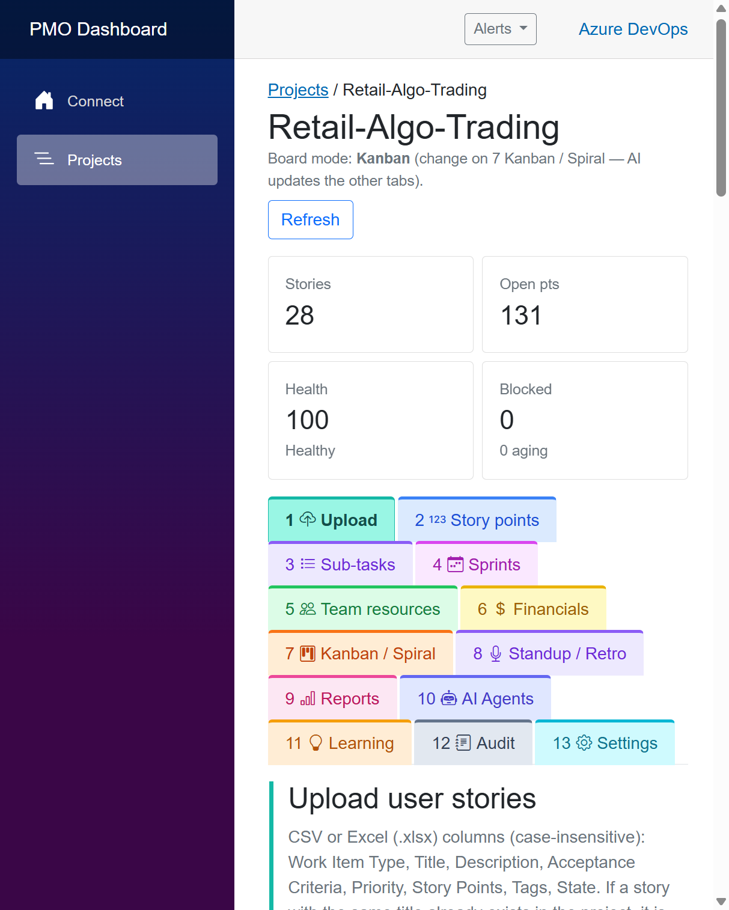

### 2 — Story points / grooming

Fibonacci or T-shirt (**1 point = 1 day**). AI can suggest points and order. Manual changes trigger plan realignment — confirm before Azure DevOps writes.

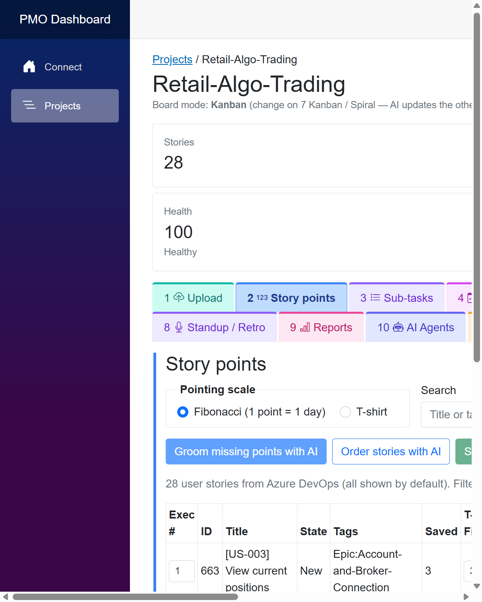

### 3 — Sub-tasks

Only pointed stories are eligible. Pick a story type template and create matching child tasks.

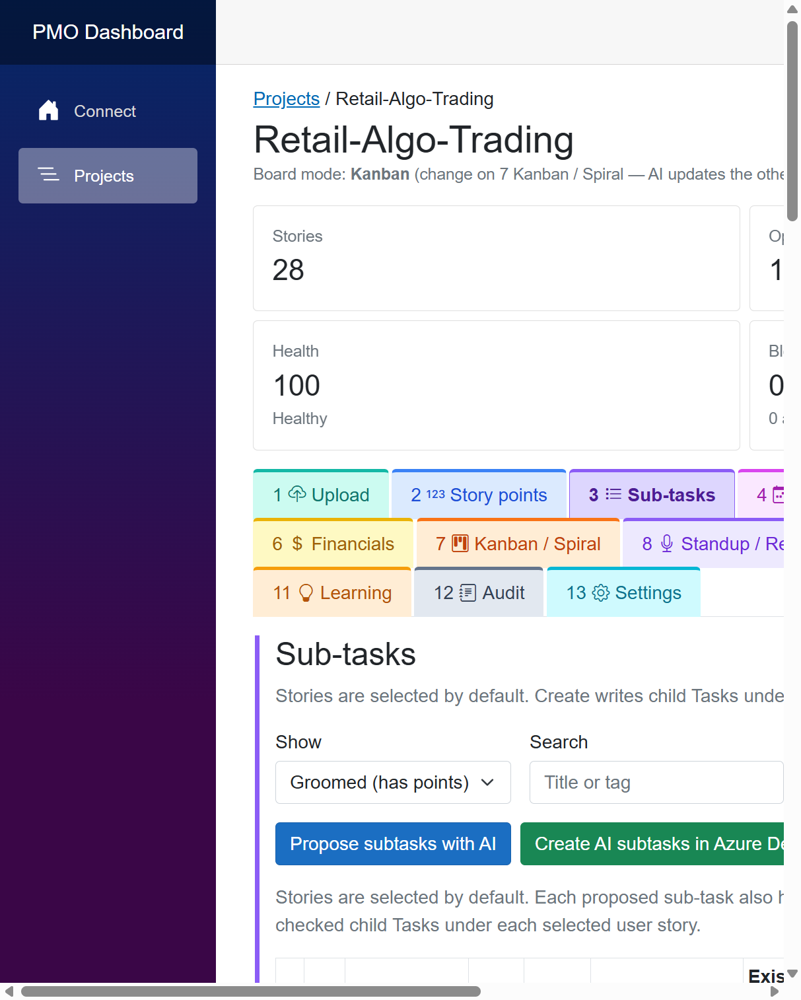

### 4 — Sprints

Set duration and start dates, create or delete sprints/cycles, then pack whole stories under a hard capacity cap (overflow spills to the next sprint).

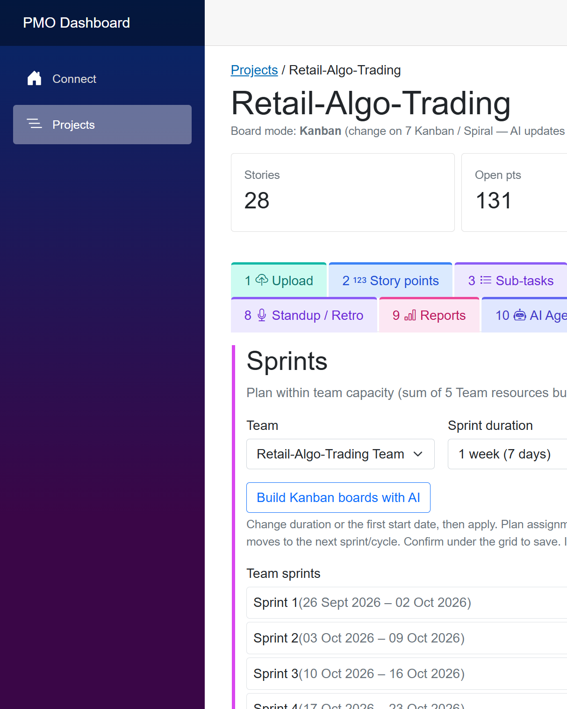

### 5 — Team resources

ADO members, start dates, story burn per sprint, and assigned load. Changing burn rates re-fits capacity across Tabs 4–6.

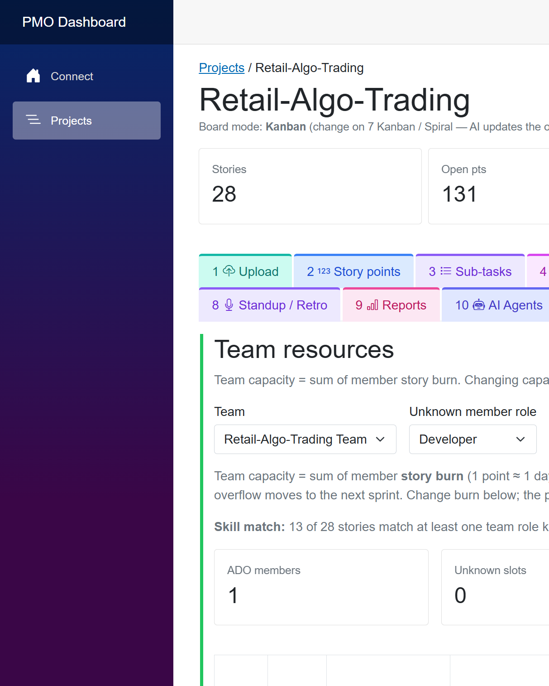

### 6 — Financials

**Fixed** or **T&M** billing. Sprint-by-sprint bill under capacity. After a sprint finishes, generate a **PDF invoice**.

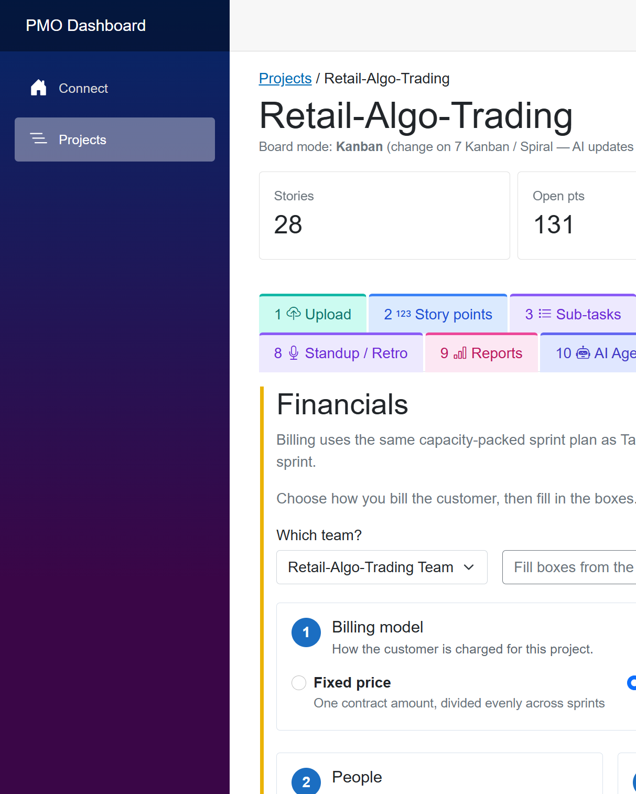

### 7 — Kanban / Spiral

Delivery-mode radios; sprint- or cycle-wise boards (ADO states), blockers, aging; AI re-fit with confirm before write.

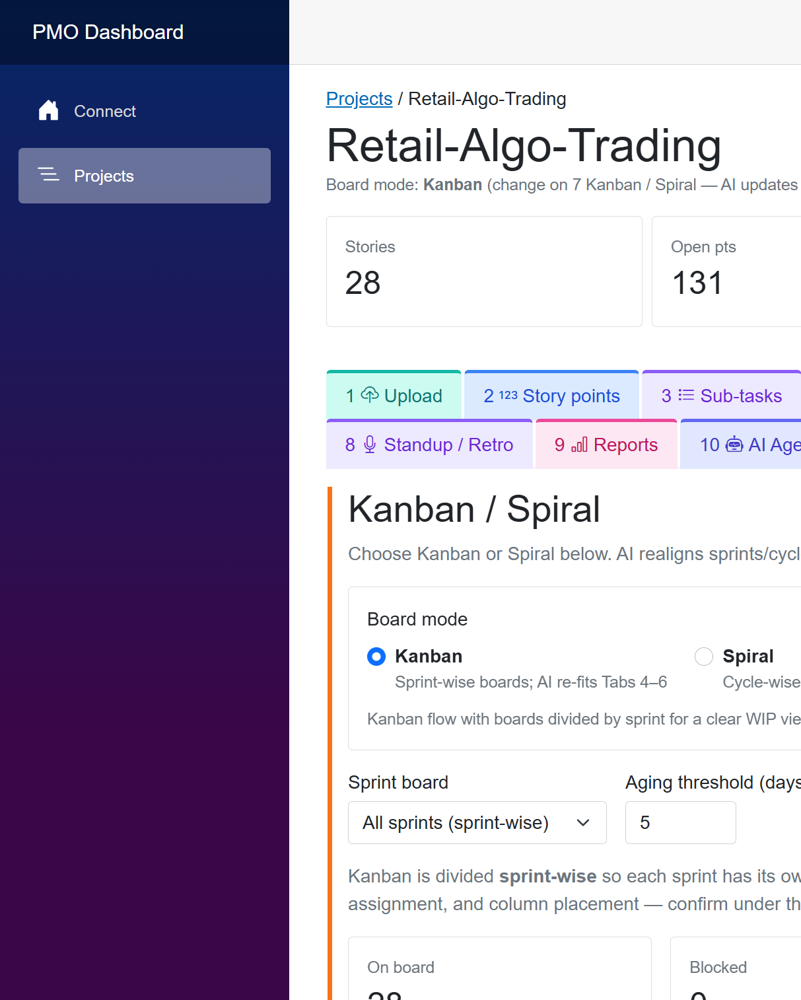

### 8 — Standup / Retro

Listen or paste daily standup / sprint retrospective. Add impediments manually. AI prioritizes at standup end. After a retro, send the issues list to the team.

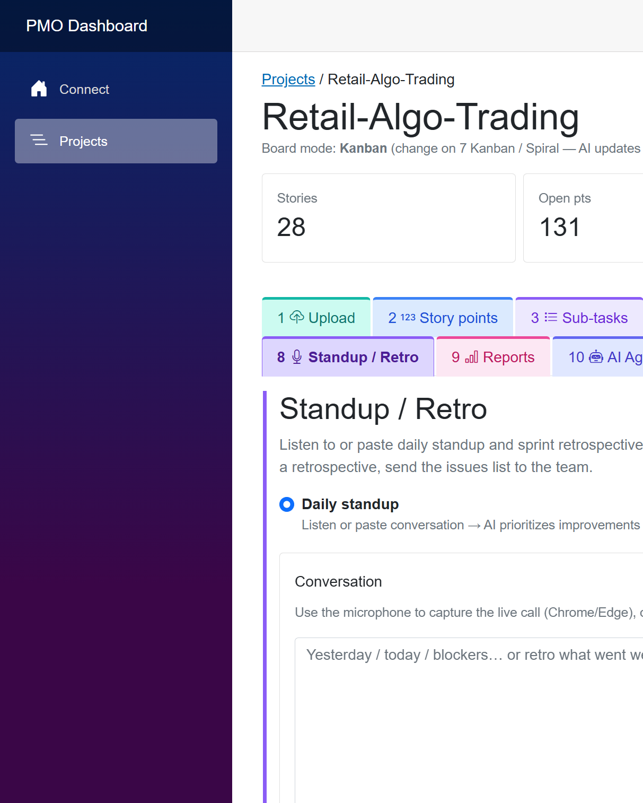

### 9 — Reports

Report-type dropdown + charts. Default: **current sprint burndown**. Also velocity, capacity / planned / delivered, and more.

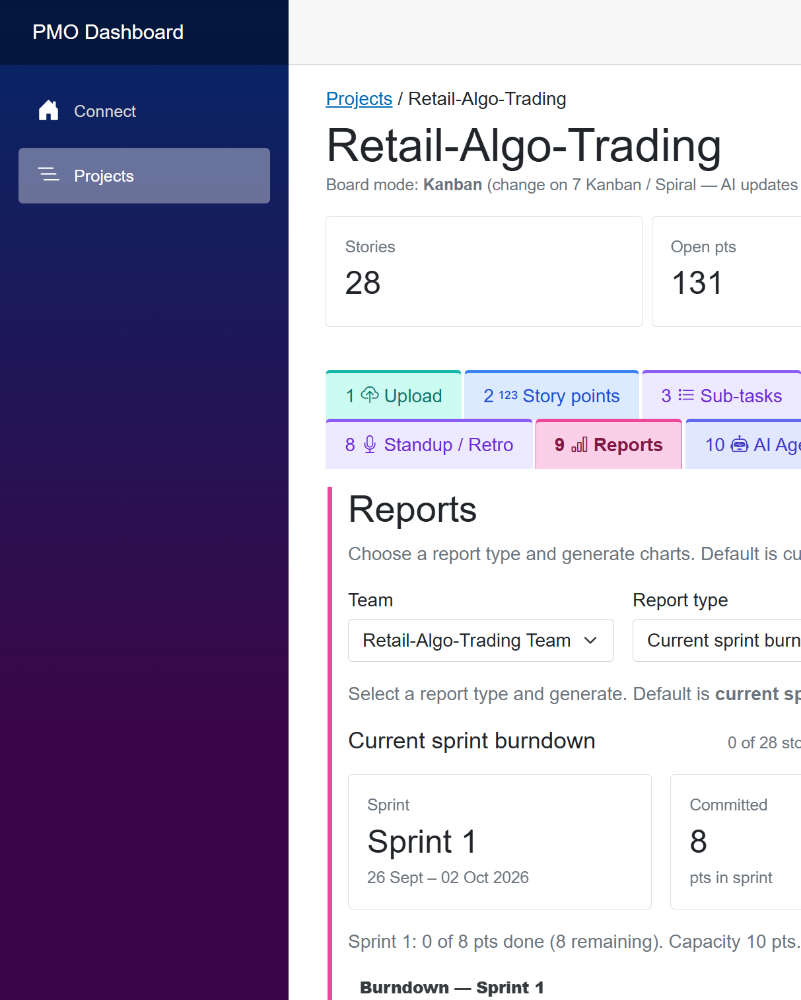

### 10 — AI Agents

Starter prompts + free-text Ask. Review → Approve / Reject. Approved answers stay pinned with a suggested next tab.

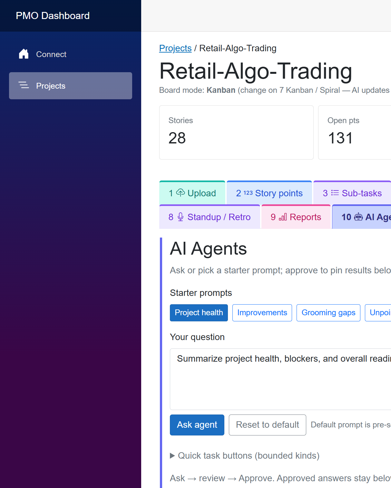

### 11 — Learning

Estimation accuracy, planning variance, grooming gaps, prompt hashes.

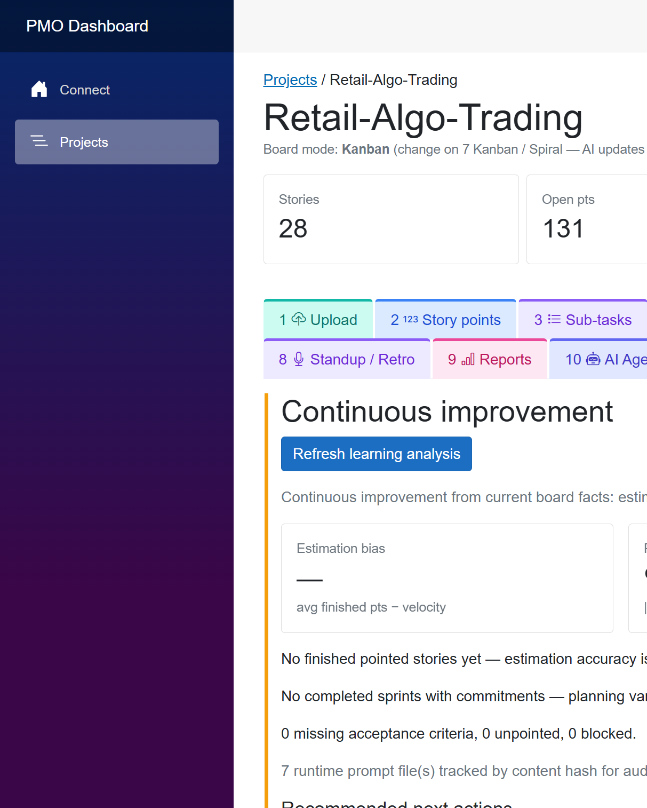

### 12 — Audit

Searchable session audit trail of connects, estimates, confirms, and other actions.

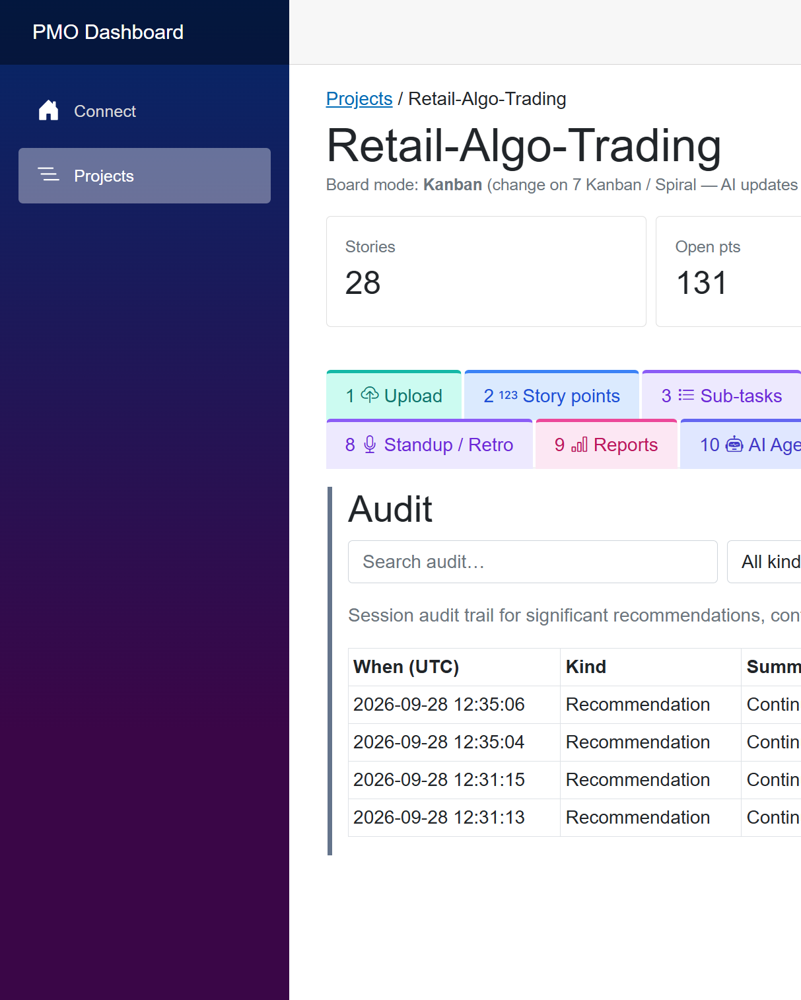

### 13 — Settings

AI endpoint / model / key (OpenAI-compatible or local Ollama), notifications, prompt defaults.

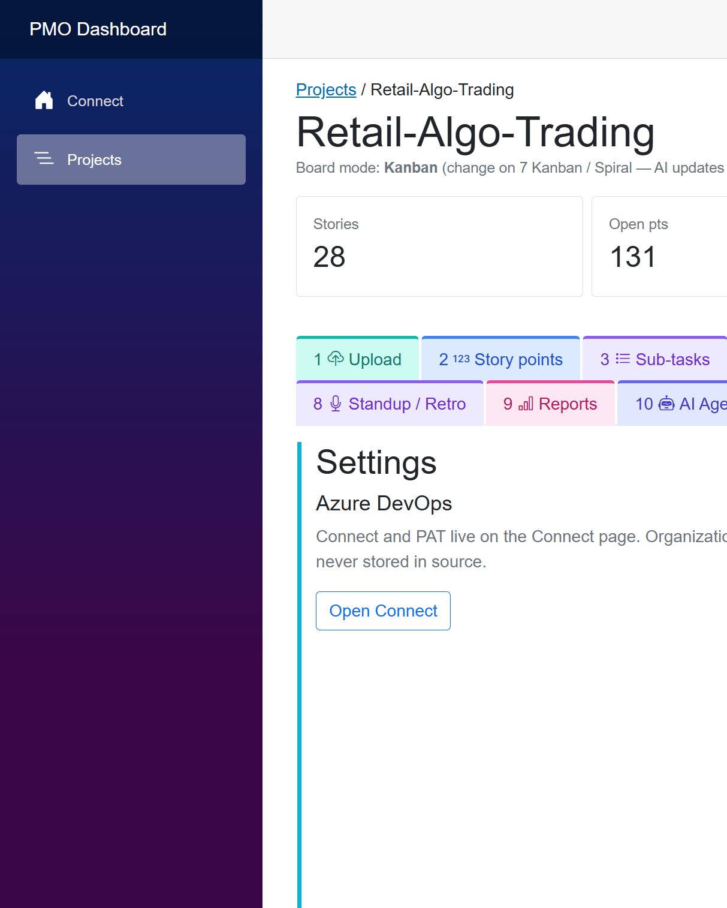

## Thirteen-tab workspace

| Tab | Purpose |
| --- | --- |
| 1 — Upload | Preview CSV/Excel stories, skip duplicates by title, then create work items in Azure DevOps after confirm. |
| 2 — Story points / grooming | Fibonacci or T-shirt (**1 point = 1 day**). AI pointing & order; grooming for AC / deps / risks. |
| 3 — Sub-tasks | Only pointed stories. Story-type templates → child tasks. |
| 4 — Sprints | Duration, dates, pack under hard capacity; overflow to next sprint. |
| 5 — Team resources | ADO members, burn rates, assigned load; burn changes re-fit capacity. |
| 6 — Financials | Fixed or T&M; people / work / money; capacity-capped sprint bill; PDF invoice. |
| 7 — Kanban / Spiral | Mode radios; sprint- or cycle-wise boards; confirm before ADO write. |
| 8 — Standup / Retro | Listen/paste standup and retro; manual impediments; AI prioritize; email retro issues. |
| 9 — Reports | Burndown (default), velocity, capacity / planned / delivered, and more. |
| 10 — AI Agents | Starter prompts + Ask; Approve / Reject; next-tab tips. Never writes ADO directly. |
| 11 — Learning | Estimation accuracy, planning variance, grooming gaps. |
| 12 — Audit | Searchable session audit trail. |
| 13 — Settings | AI endpoint/model/key, notifications, prompt defaults. |

## Principles

- Scrum by default; Kanban and Spiral modes are also supported.
- Typical sprint length is 2 weeks (configurable).
- **1 story point = 1 day** (initial assumption).
- **Azure DevOps** is the source of truth for work-item state.
- AI recommendations require **human confirmation** before Azure DevOps writes.
- Hard capacity: overload spills to the next sprint.
- Personal Microsoft accounts use **PAT-based Connect** (not work/school Entra).

## Source of truth

- **This GitHub repository:** screenshots and product overview only (no app source).
- **Azure DevOps:** live work items, sprints, and team membership — users connect their org through the product UI.
